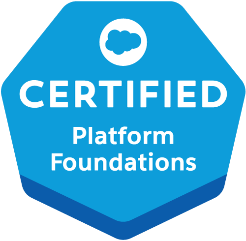
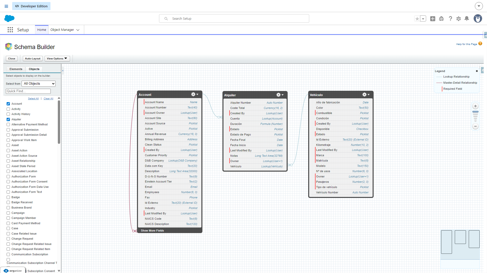
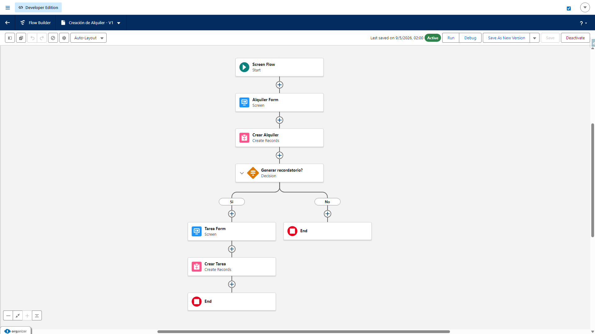
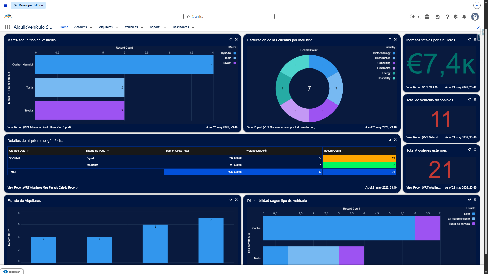

# AlquilaVehículo S.L. — Solución de Gestión Integral en Salesforce

<a href="https://www.salesforce.com/trailblazer/danjimen" target="_blank">
  
</a>

Este repositorio contiene la arquitectura de metadatos y el desarrollo programático de una solución CRM de extremo a extremo diseñada para **AlquilaVehículo S.L.**, una empresa ficticia de alquiler de flotas y gestión de reservas. 

El proyecto combina de forma eficiente la **potencia declarativa** de la plataforma (Core Setup, Flows, Seguridad) con la **robustez programática** de la capa de desarrollo (Apex Classes, Triggers, Asynchronous Apex).

---

## 🛠️ Stack Tecnológico & Herramientas
* **Platform & Config:** Salesforce Enterprise / Developer Org, Flow Builder, Lightning App Builder.
* **Capa Programática:** Apex (Triggers, Handlers, Scheduled Apex), Apex Test Classes (`@isTest`).
* **Developer Experience:** Salesforce DX (SFDX), Visual Studio Code, Git & GitHub.

---

## 📐 Arquitectura y Modelo de Datos (Data Model)

Se ha diseñado un modelo de datos relacional optimizado para garantizar el rendimiento de las consultas y mantener la integridad referencial del negocio:

* **Account (Cuentas/Clientes):** Gestión de clientes finales, segmentación y datos de facturación.
* **Vehículo (`Vehiculo__c`):** Objeto personalizado que actúa como maestro para el control de la flota (Matrícula, Marca, Modelo, Tipo de Combustible, Estado actual).
* **Alquiler (`Alquiler__c`):** Objeto de unión y transaccional (Relación *Master-Detail* / *Lookup*) que controla las reservas, fechas de inicio/fin, estados del servicio y tarifas acumuladas.

> 💡 **Reglas de Validación Implementadas:** Lógica declarativa estricta para evitar inconsistencias operativas, tales como impedir reservas con fechas de fin anteriores a la fecha de inicio o bloquear el alquiler de vehículos marcados "En mantenimiento".

<p align="center">
  
</p>

---

## ⚙️ Automatización Declarativa (Flow Builder)

Se han desplegado automatizaciones visuales para optimizar la experiencia de usuario y agilizar los flujos de trabajo internos:
* **Record-Triggered Flows:** Automatización instantánea del cambio de estado del vehículo (`Disponible` ➡️ `Alquilado`) al confirmarse el inicio de un registro de Alquiler.
* **Screen Flows:** Asistentes guiados para los agentes en tienda con el fin de estandarizar la recogida de datos y la creación ágil de nuevas reservas disminuyendo el error humano.

<p align="center">
  
</p>

---

### 📊 Interfaz de Usuario y Analítica (Lightning App & Dashboards)

Para optimizar la toma de decisiones y centralizar las operaciones diarias de **AlquilaVehículo S.L.**, se ha diseñado una aplicación personalizada en el ecosistema Lightning. El núcleo operativo cuenta con una página de inicio (*Home Page*) inteligente y cuadros de mando interactivos que consolidan métricas clave del negocio en tiempo real.

* **Cuadros de Mando (Dashboards):** Implementación de componentes visuales para la monitorización instantánea de KPIs críticos: tasa de ocupación de la flota, vehículos actualmente en taller, segmentación por tipo de combustible y facturación mensual acumulada.
* **Informes Personalizados (Custom Report Types):** Construcción y estructuración de tipos de informes a medida sobre los objetos `Alquiler__c` y `Vehiculo__c`, permitiendo el filtrado avanzado de datos y garantizando la escalabilidad analítica para los gestores.

<p align="center">
  
  <br>
  <em>Vista global de la aplicación con el panel de control y analíticas de flota en tiempo real.</em>
</p>

---

## 💻 Capa Programática (Apex Development)

Para las reglas de negocio complejas que exceden las capacidades declarativas, se ha implementado código Apex limpio, modular y optimizado para la gobernanza de límites (*Bulkified*):

### 1. Apex Triggers & Handlers
* **Lógica Avanzada de Reservas:** Despliegue de disparadores en el objeto `Alquiler__c` para calcular tarifas dinámicas basadas en fines de semana, temporadas o el tipo de vehículo seleccionado en el momento de la inserción (*Before Insert*).
* **Control de Conflictos:** Validación programática que bloquea la creación de un alquiler si el vehículo seleccionado ya cuenta con una reserva solapada en el mismo rango de fechas.

### 2. Asynchronous & Scheduled Apex
* **Mantenimiento Automatizado:** Clase Apex programable (`Schedulable`) diseñada para ejecutarse de forma asíncrona todas las noches. Evalúa los alquileres activos vencidos y actualiza masivamente el estado de los vehículos a `Retrasado`, disparando notificaciones automáticas para los gestores.

### 3. Calidad de Software (Apex Testing)
* Cobertura de código robusta mediante **clases de prueba (`@isTest`)** que validan tanto los flujos de ejecución positivos como el manejo de excepciones y errores (*Bulk tests*), cumpliendo con las mejores prácticas de despliegue en producción.

---

## 🔒 Seguridad y Experiencia de Usuario (UX/UI)

* **Modelo de Seguridad:** Configuración de la visibilidad y edición mediante **Roles, Perfiles y Conjuntos de Permisos (Permission Sets)** diferenciados para *Agentes de Tienda* (operativos) y *Gestores de Flota* (administración global).
* **Lightning Pages & Apps:** Creación de la aplicación personalizada "AlquilaVehículo" con Dashboards e informes en tiempo real integrados en la página de inicio para monitorizar KPIs críticos: Tasa de ocupación de la flota, vehículos en taller y facturación mensual.

---

## 🚀 Cómo Desplegar este Proyecto

Si deseas explorar o desplegar este proyecto en tu propia Developer Org o Scratch Org, sigue estos pasos:

1. **Clona el repositorio:**
   ```bash
   git clone https://github.com/BishopVK/AlquilaVehiculoSL-Salesforce.git
   cd AlquilaVehiculoSL-Salesforce
   ```

2. **Autoriza tu Org de destino:**
    ```bash
    sf org login web -a mi-org
    ```

3. **Despliega los metadatos y el código:**
    ```bash
    sf project deploy start
    ```

---

## 👤 Contacto & Conectividad
- **Desarrollador:** Daniel Jiménez Graindorge
- **Salesforce Trailhead Profile:** [salesforce.com/trailblazer/danjimen](https://www.salesforce.com/trailblazer/danjimen)
- **LinkedIn:** [linkedin.com/in/daniel-jimenez-graindorge](https://www.linkedin.com/in/daniel-jimenez-graindorge)
- **Email:** danielgraindorge@gmail.com
